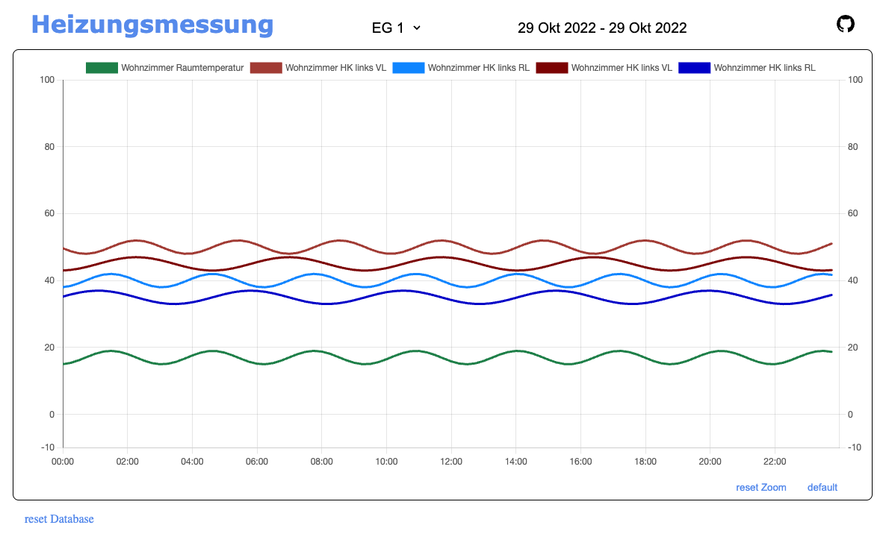

# simple heater monitoring

This PHP script collects data about the URL and stores it in an SQLite database and displays it as a chart.   

- Chart by [ChartJS](https://www.chartjs.org/)
- All configuration data stored in `store/config.json`.
- Including Pythen script for evaluation

## Install

copy the code in a local folder

run:  
`php -S localhost:9090`

### use the following links

visit chart:  
`http://localhost:9090`

create dummy data:
`http://localhost:9090/store/assets/dummy.php` 

insert values:  
`localhost:9090/store/?ESP=EG_1&WZ_TR=10&WZ_HK1_VL=29&WZ_HK1_RL=40`

initialize database: (will not delete existing db)  
`http://localhost:9090/store/?initDB`

remove database:   
`http://localhost:9090/store/?removeDB`

 

